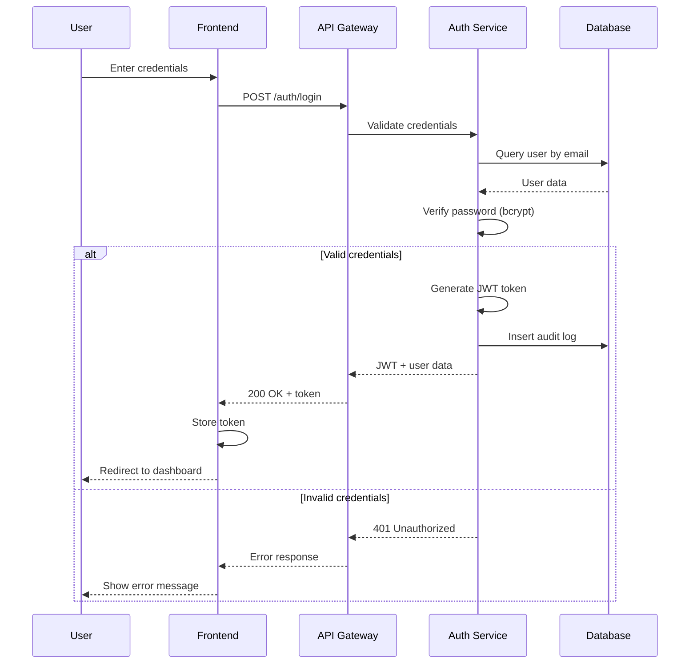
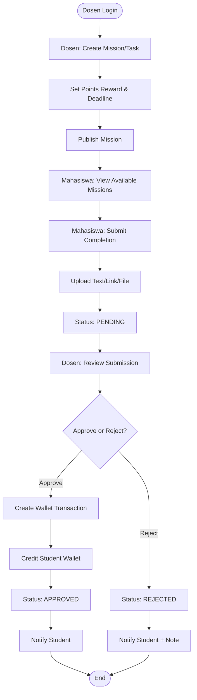
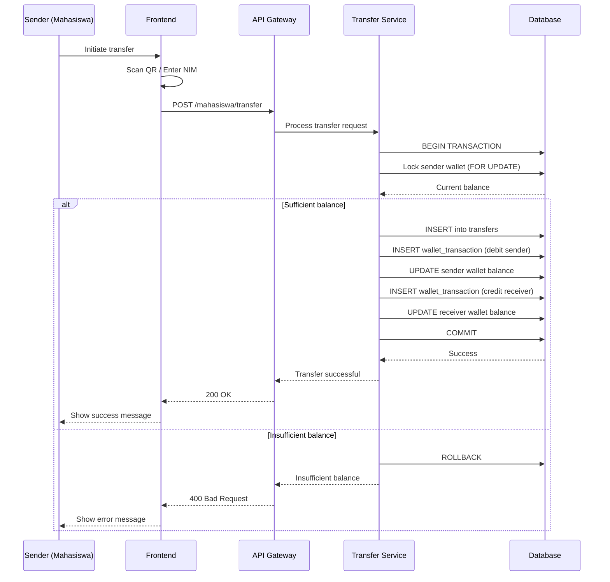
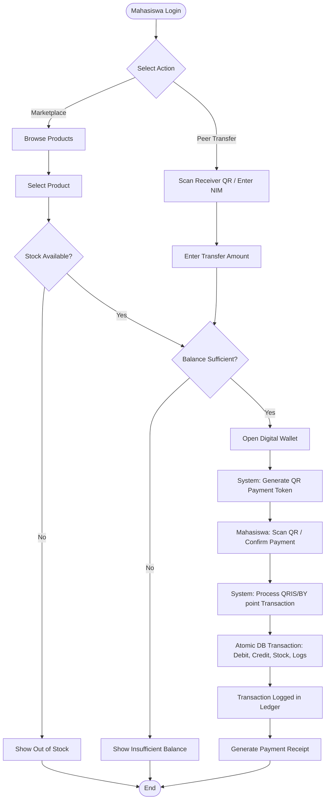
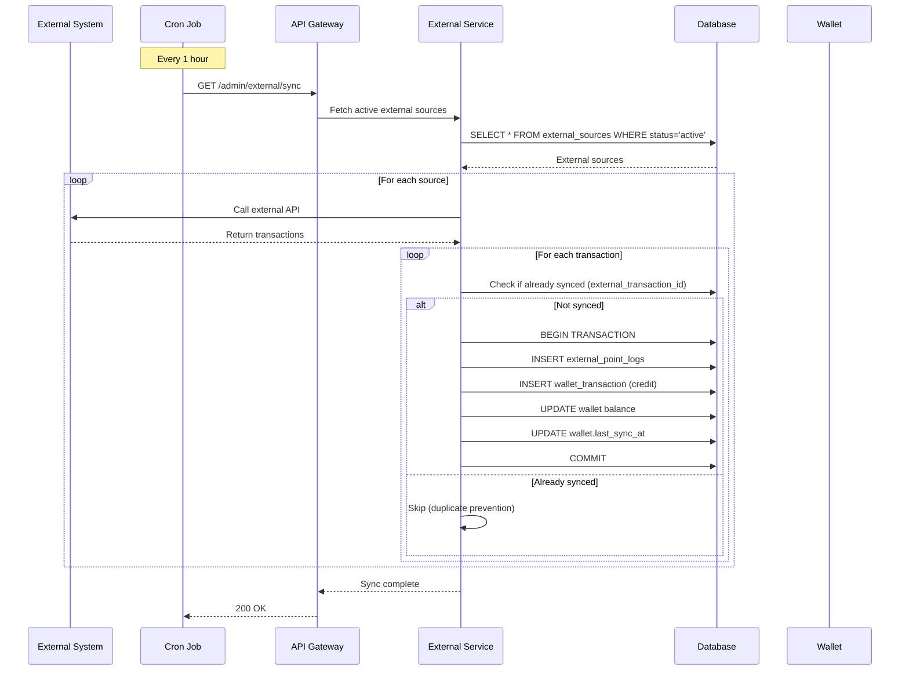
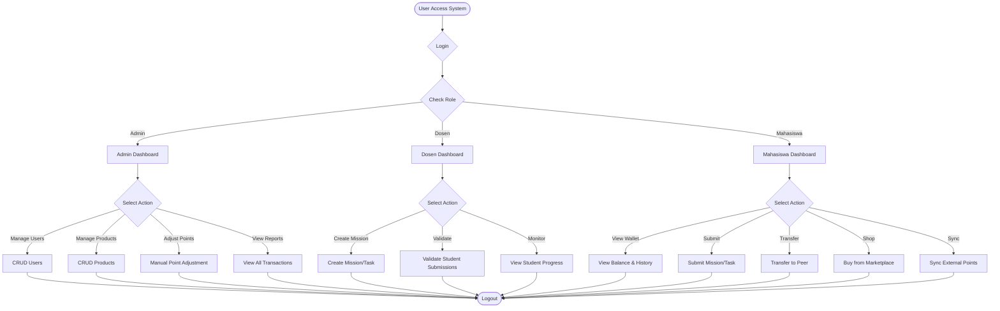

# Platform Wallet Point Gamifikasi Kampus - System Flow

## 📋 Table of Contents
1. [Authentication Flow](#authentication-flow)
2. [Mission & Task Flow](#mission--task-flow)
3. [Transfer Flow](#transfer-flow)
4. [Marketplace Flow](#marketplace-flow)
5. [External Points Flow](#external-points-flow)

---

## 🔐 Authentication Flow



**Steps**:
1. User enters email & password
2. Frontend sends POST /auth/login
3. Auth service validates credentials
4. Generate JWT token with role & user_id
5. Return token to frontend
6. Frontend stores token (localStorage/session)
7. All subsequent requests include Authorization header

---

## 🎯 Mission & Task Flow



**Detailed Steps**:

### A. Dosen Creates Mission
```http
POST /dosen/missions
Authorization: Bearer {jwt_token}
Content-Type: application/json

{
  "title": "Complete Lab Report",
  "description": "Submit lab report for Physics experiment",
  "points_reward": 100,
  "deadline": "2026-01-20T23:59:59Z",
  "status": "active"
}
```

**Backend**:
1. Validate JWT (role = dosen)
2. Insert into `missions` table
3. Return mission ID

### B. Mahasiswa Submits Mission
```http
POST /mahasiswa/missions/{mission_id}/submit
Authorization: Bearer {jwt_token}
Content-Type: multipart/form-data

{
  "submission_content": "I have completed the lab report...",
  "file": [uploaded file]
}
```

**Backend**:
1. Validate JWT (role = mahasiswa)
2. Check deadline
3. Check if already submitted (UNIQUE constraint)
4. Upload file to storage
5. Insert into `mission_submissions` (status = 'pending')
6. Return submission ID

### C. Dosen Validates Submission
```http
POST /dosen/missions/submissions/{submission_id}/validate
Authorization: Bearer {jwt_token}
Content-Type: application/json

{
  "action": "approve",  // or "reject"
  "validation_note": "Great work!"
}
```

**Backend (Atomic Transaction)**:
```go
BEGIN TRANSACTION

1. SELECT mission_id, student_id, points_reward FROM mission_submissions
   WHERE id = submission_id FOR UPDATE

2. UPDATE mission_submissions
   SET status = 'approved', validated_by = dosen_id, validated_at = NOW()
   WHERE id = submission_id

3. INSERT INTO wallet_transactions
   (wallet_id, type, amount, direction, reference_id, status, created_by)
   VALUES (student_wallet_id, 'mission', points_reward, 'credit', submission_id, 'success', 'dosen')

4. UPDATE wallets SET balance = balance + points_reward WHERE id = student_wallet_id

5. INSERT INTO audit_logs (action, table_name, record_id, user_id)
   VALUES ('APPROVE_MISSION', 'mission_submissions', submission_id, dosen_id)

COMMIT
```

---

## 💸 Transfer Flow



**Request**:
```http
POST /mahasiswa/transfer
Authorization: Bearer {jwt_token}
Content-Type: application/json

{
  "receiver_nim": "2023002",
  "amount": 50,
  "note": "Payment for group project"
}
```

**Atomic Transaction**:
```sql
CALL sp_process_transfer(sender_wallet_id, receiver_wallet_id, amount, note, 
    @transfer_id, @success, @message);
```

---

## 🛒 Integrated Commerce & QR Flow



**Integrated Commerce Steps**:

### A. Point Usage (Marketplace or Peer-to-Peer)
**Workflow**:
1. **Selection**: Mahasiswa chooses to buy an item or transfer points.
2. **Payment Token**: System validates initial constraints (stock/balance) and generates a temporary transaction token.
3. **QR Interaction**: Mahasiswa scans the QR code (for marketplace) or confirms identified recipient (for transfer).
4. **Processing**: Backend executes an atomic transaction:
   - For Marketplace: `Debit Wallet` -> `Decrement Stock` -> `Log Marketplace Transaction`
   - For Transfer: `Debit Sender` -> `Credit Receiver` -> `Log Transfer`
5. **Finalization**: Transaction is recorded in the immutable Ledger, and a Receipt is shown to the user.

**Atomic DB Level (sp_process_transaction)**:
```sql
BEGIN;
  -- 1. Identity Verification
  -- 2. Balance & Stock Locking
  -- 3. Point Movement (Debit/Credit)
  -- 4. Audit & Receipt Logging
COMMIT;
```

---

## 🌐 External Points Flow



**Manual Sync Request**:
```http
POST /admin/external/sync
Authorization: Bearer {jwt_token}
Content-Type: application/json

{
  "source_id": 1,
  "user_nim": "2023001"
}
```

**Backend Process**:
```go
// 1. Call external API
response := callExternalAPI(source.APIEndpoint, user.NimNip)

// 2. Validate response
for _, txn := range response.Transactions {
    // 3. Check duplicate
    exists := db.Where("external_transaction_id = ?", txn.ID).First(&ExternalPointLog{}).Error
    if exists == nil {
        continue // Skip
    }
    
    // 4. Create transaction (atomic)
    tx := db.Begin()
    
    // Insert log
    log := ExternalPointLog{
        WalletID: wallet.ID,
        ExternalSourceID: source.ID,
        ExternalTransactionID: txn.ID,
        Amount: txn.Amount,
        Metadata: txn.Metadata,
        Status: "success",
    }
    tx.Create(&log)
    
    // Credit wallet
    walletTx := WalletTransaction{
        WalletID: wallet.ID,
        Type: "external",
        Amount: txn.Amount,
        Direction: "credit",
        ReferenceID: log.ID,
        Status: "success",
        CreatedBy: "system",
    }
    tx.Create(&walletTx)
    
    // Update balance
    tx.Model(&wallet).Update("balance", gorm.Expr("balance + ?", txn.Amount))
    tx.Model(&wallet).Update("last_sync_at", time.Now())
    
    tx.Commit()
}
```

---

## 🔄 Activity Diagram: Complete System Flow



---

**Version**: 1.0  
**Last Updated**: 2026-01-13
